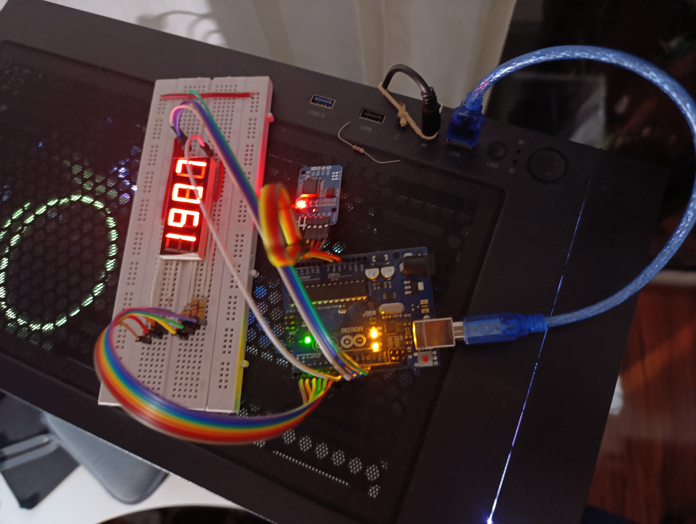

# Fase ARDUINO

Esta carpeta contiene la implementación y pruebas del sistema de reloj digital usando un módulo RTC DS3231 y una pantalla de 7 segmentos de 4 dígitos.

## Tabla de contenido

1. [Estructura](#estructura)
2. [Componentes utilizados](#-componentes-utilizados)
3. [Descripción del funcionamiento](#descripción-del-funcionamiento)
    1. [`Arduino-bin.ino`](#arduino-binino)
    2. [`reloj_con_7_Segmentos.ino`](#reloj_con_7_segmentosino)
4. [Imagen del montaje](#imagen-del-montaje)
5. [Notas adicionales](#notas-adicionales)

---

## Estructura

- `Arduino-bin/Arduino-bin.ino`  
  Código que obtiene la hora desde el módulo RTC y la transmite en binario a través del monitor serial.

- `reloj_con_7_Segmentos/reloj_con_7_Segmentos.ino`  
  Código para mostrar la hora en un display de 7 segmentos usando multiplexación.

- `IMG_20250618_190723.jpg`  
  Imagen del montaje físico del sistema Arduino.

---

## 🔧 Componentes utilizados

- Arduino UNO
- Módulo RTC DS3231
- Display de 4 dígitos, ánodo común
- Resistencias de 220Ω
- Cables de conexión

---

## Descripción del funcionamiento

### `Arduino-bin.ino`

Este archivo permite visualizar los valores de la hora en formato binario por el monitor serial.  
Se extraen los dígitos de las horas y minutos, y se convierten en binario usando la función `bitRead` (Se implementa en la FPGA).

```

#include <Wire.h>
#include <RTClib.h>

RTC_DS3231 rtc;

void printBin(uint8_t value, uint8_t bits = 4) {
  for (int8_t i = bits - 1; i >= 0; --i)
    Serial.print(bitRead(value, i));
}

void setup() {
  Serial.begin(9600);
  while (!Serial);
  Wire.begin();
  rtc.begin();
}

void loop() {
  DateTime now = rtc.now();

  uint8_t h1 = now.hour()   / 10;
  uint8_t h2 = now.hour()   % 10;
  uint8_t m1 = now.minute() / 10;
  uint8_t m2 = now.minute() % 10;

  printBin(h1); Serial.print(" ");
  printBin(h2); Serial.print(":");
  printBin(m1); Serial.print(" ");
  printBin(m2); Serial.println();
}

```

### `reloj_con_7_Segmentos.ino`

Este archivo muestra la hora en un display de 4 dígitos utilizando multiplexación.
Usa un mapa de segmentos para representar cada número y un sistema de refresco rápido para activar un dígito a la vez.


```

#include <Wire.h>
#include <RTClib.h>

RTC_DS3231 rtc; // Se usa ánodo común

const uint8_t segPins[7]  = {2, 3, 4, 5, 6, 7, 8};   // a b c d e f g
const uint8_t digPins[4]  = {9, 10, 11, 12};         // dígitos

const uint8_t segMap[10] = {
  0b00111111, 0b00000110, 0b01011011, 0b01001111,
  0b01100110, 0b01101101, 0b01111101, 0b00000111,
  0b01111111, 0b01101111
};

uint8_t digits[4];
unsigned long tSec = 0;

void setSegments(uint8_t pattern) {
  for (uint8_t s = 0; s < 7; s++) {
    bool bit = (pattern >> s) & 0x01;
    digitalWrite(segPins[s], bit ? LOW : HIGH);
  }
}

void refreshDisplay() {
  for (uint8_t d = 0; d < 4; d++) {
    digitalWrite(digPins[d], HIGH);
    setSegments(segMap[digits[d]]);
    delayMicroseconds(2000);
    digitalWrite(digPins[d], LOW);
  }
}

void setup() {
  for (uint8_t i = 0; i < 7; i++) pinMode(segPins[i], OUTPUT);
  for (uint8_t i = 0; i < 4; i++) pinMode(digPins[i], OUTPUT);

  Wire.begin();
  rtc.begin();
}

void loop() {
  DateTime now = rtc.now();

  digits[0] = now.hour() / 10;
  digits[1] = now.hour() % 10;
  digits[2] = now.minute() / 10;
  digits[3] = now.minute() % 10;

  refreshDisplay();
}

```
## Imagen del montaje

<p align="center"> 
     
</p>

## Notas adicionales

- Hay que asegurar que el display sea ánodo común. Se identificó un error inicial por suponer que era cátodo común.
- Las conexiones deben respetar el orden de los pines segPins y digPins.
- El multiplexado evita el uso de múltiples controladores, optimizando el uso de pines en el Arduino.
