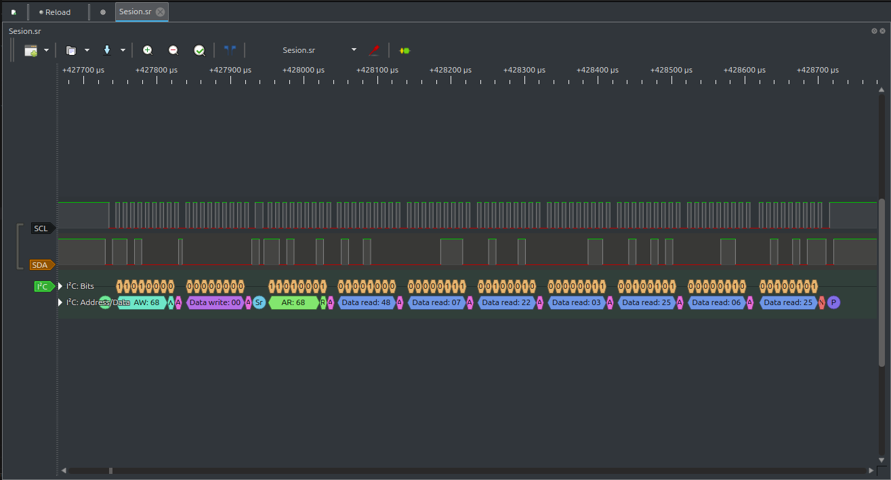
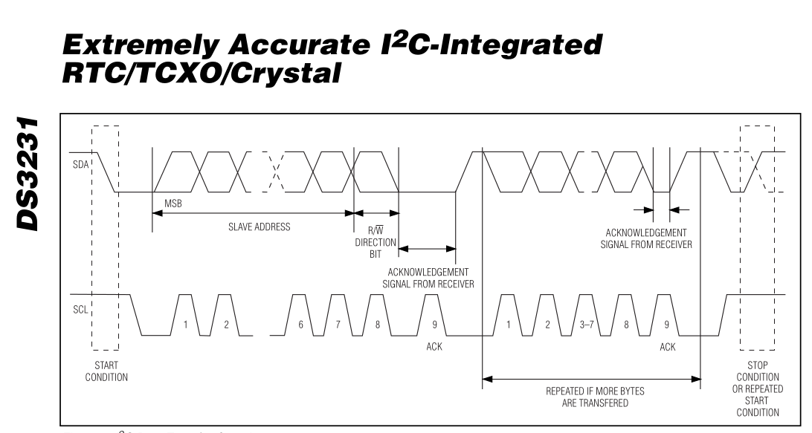
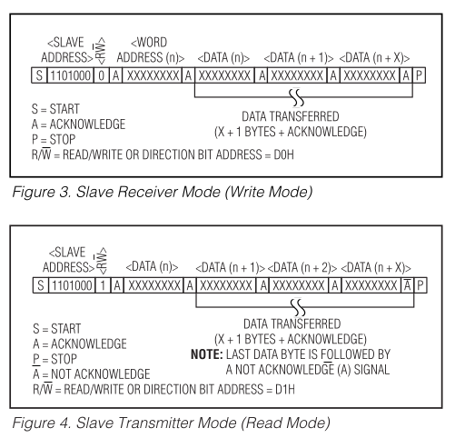
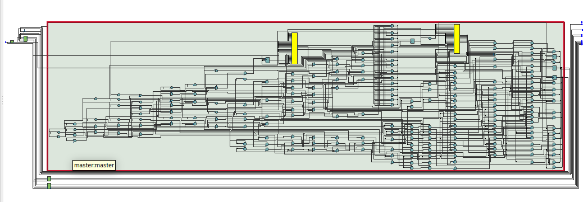
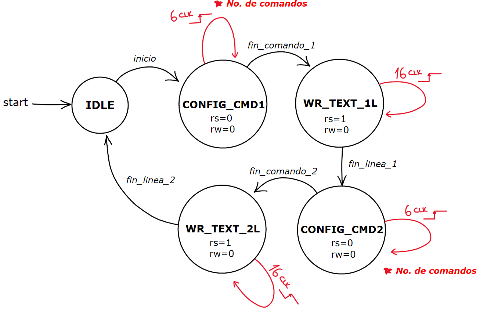
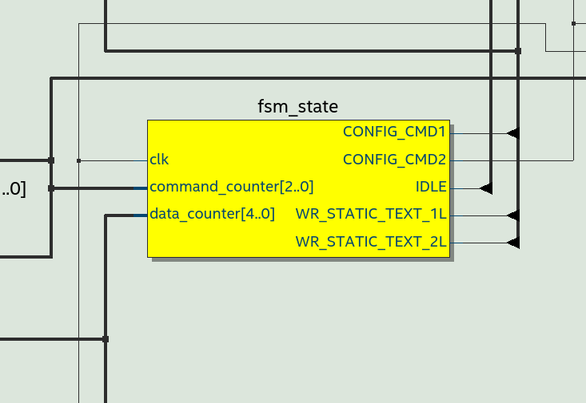
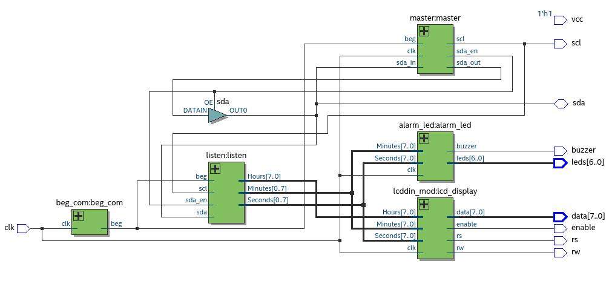
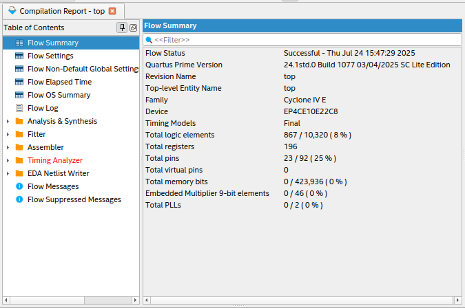

# Arquitectura Digital

## Tabla de Contenido

1. [Arquitectura Digital](#arquitectura-digital)
    1. [Protocolo de Comunicación](#protocolo-de-comunicación)
    2. [Visualización](#visualización)
    3. [Videos de funcionamiento progresivo](#videos-de-funcionamiento)
    4. [Notas adicionales](#notas-adicionales)


El componente principal del sistema es **el módulo RTC (Real Time Clock) DS3231**, por lo que comprender su modo de operación *resulta fundamental*. Inicialmente, se planteó desarrollar el proyecto utilizando una placa **Arduino Uno**, con el objetivo de adaptar el sistema a las necesidades específicas del diseño, principalmente el muestreo de la hora en un elemento visual. A través de la **integración del sensor** y el uso de **librerías de Arduino**, se buscaba facilitar la comprensión del **funcionamiento del RTC.**

De este modo, se decidió construir un "pseudoproyecto" con *Arduino*, *permitiendo su montaje y verificación práctica* (visualización de la hora actual). A partir de su correcto funcionamiento, en esta etapa se pensaba posible **analizar la lógica empleada** para luego replicarla y adaptarla al entorno de programación en **FPGA**.

### Protocolo de Comunicación

El módulo comentado, al seguir una comunicación $I^2C$, obliga a crear el protocolo de comunicación que sirva para relacionar la información con la **FPGA**. Para poder comprenderlo a un nivel bajo de abstracción fue necesario hacer uso de un **analizador lógico**, por medio de la interfaz gráfica *Pulseview*, sobre ambos cables de comunicación tras la implementación de la subsección mencionada anteriormente (*véase* figura [fig: Pulseview]).


<div align="center">
  
  <p><em>Figura 1: Pulseview inicial</em></p>
</div>

<table align="center">
  <tr>
    <td align="center">
      
      <div><em>Figura 2: I²C Data Transfer Overview <i>Datasheet</i></em></div>
    </td>
    <td align="center">
      
      <div><em>Figura 3: I²C RW Mode <i>Datasheet</i></em></div>
    </td>
  </tr>
</table>

Con esta información y el datasheet del **DS3231**, se tenía lo suficiente para empezar a construir el primero de los módulos: el módulo **master**.

1. **master**: Este módulo funciona como maestro del bus $I^2C$, gestionando la secuencia completa de comunicación: desde el envío de condiciones de *start/stop* hasta la lectura/escritura de datos. Implementa una **máquina de estados**, una serie de **flags** y un **contador**, para replicar lo necesario para pedir la información requerida al RTC.

#### Ejemplo de la lógica detrás de uno de los estados: `Start`

```verilog
Start : 
    if (st_prev == Default) begin
      if (counter == Ns) begin
        sda_out <= 0;
        scl <= 1;
        counter <= counter + 1;
      end else if (counter == 2*Ns)begin
        sda_out <= 0;
        scl <= 0;
        counter <= counter + 1;
      end else if (counter == 3*Ns)begin
        sda_out <= 1;
        scl <= 0;
        counter = 0;
        state <= Send_Add;
        st_prev <= Default;
      end else counter <= counter +1;
    end
    // Restart
    else if (st_prev == Send_Reg) begin
      if (counter == Ns) begin
        sda_out <= 1;
        scl <= 1;
        counter <= counter + 1;
      end else if (counter == 2*Ns)begin
        sda_out <= 0;
        scl <= 1;
        counter <= counter + 1;
      end else if (counter == 3*Ns)begin
        sda_out <= 0;
        scl <= 0;
        counter <= counter +1;
      end else if (counter == 3*Ns +Delay)begin
        sda_out <= 1;
        scl <= 0;
        counter = 0;
        state <= Send_Add;
        st_prev <= Restart;
      end else counter <= counter +1;
    end 
```

Adicionalmente, este módulo prepara la lectura de la información con su estado de **listen**, y manda una señal que gestiona la activación de **SDA** en su estado de alta impedancia, pasándole el control al *Slave*.



*Figura: Representación RTL Viewer del módulo master*

2. **beg_com**: Este módulo se encarga de generar la condición de inicio **Start** del protocolo $I^2C$ cada 2 segundos para iniciar la comunicación. Adicionalmente, la señal generada por este módulo va a ser de utilidad en el módulo `listen`, pues sincroniza la captura de la información.

3. **listen**: Responsable de recibir los bits desde el RTC por la línea **sda**, sincronizado con **scl**. Interpreta los datos leídos y detecta los bits de ACK/NACK. Implementa una función para invertir los bits recibidos para un correcto guardado de la información.

#### Cargue paralelo

```verilog
always @(posedge scl) begin
    if ((sda_en == 0)& (count != Ndata)) begin        
        data[count] <= sda;
        count <= count + 1;

    end else if (count == Ndata) begin
        count <= 0;
    end
    
end

function [7:0] reverse_bits8;
    input [7:0] in;
    integer i;
    begin
        for (i = 0; i < 8; i = i + 1) begin
            reverse_bits8[i] = in[7 - i];
        end
    end
endfunction

always @(negedge beg) begin
    Acknowledge[2:0] <= data[2:0];
    Seconds <= reverse_bits8(data[10:3]);
    Minutes <= reverse_bits8(data[18:11]);
    Hours <= reverse_bits8(data[26:19]);
    Day <= reverse_bits8(data[34:20]);
    Date <= reverse_bits8(data[42:35]);
    Month <= reverse_bits8(data[50:43]);
    Year <= reverse_bits8(data[58:51]);
end
```
### Visualización

1. **lcddin_mod**: Se encarga de gestionar el envío de la hora para la representación visual en la **LCD**.

A continuación, se detallan los componentes principales del módulo:

#### Definición de estados

```verilog
localparam IDLE              = 3'b000;
localparam STORE_DATA        = 3'b001;
localparam CONFIG_CMD1       = 3'b010;
localparam WR_STATIC_TEXT_1L = 3'b011;
localparam CONFIG_CMD2       = 3'b100;
localparam WR_STATIC_TEXT_2L = 3'b101;
```

Estos valores representan los distintos estados internos de la máquina de control. Cada uno define una etapa del proceso de configuración o escritura hacia la LCD, incluyendo comandos de inicio, escritura de datos en cada línea, y control del flujo interno.

#### Conversión de BCD a ASCII

```verilog
// Todas inician en 0
wire [7:0] Hours_dec  = Hours[7:4] + 8'd48;
wire [7:0] Hours_uni  = Hours[3:0] + 8'd48;
wire [7:0] Min_dec    = Minutes[7:4] + 8'd48;
wire [7:0] Min_uni    = Minutes[3:0] + 8'd48;
wire [7:0] Sec_dec    = Seconds[7:4] + 8'd48;
wire [7:0] Sec_uni    = Seconds[3:0] + 8'd48;

```

Esta sección realiza la conversión de los datos de hora codificados en BCD (típico de un RTC) al formato ASCII requerido por la pantalla LCD. Se aprovecha el hecho de que los números del 0 al 9 en ASCII van del 48 al 57, por lo que simplemente se suma 48 a cada dígito.

#### Buffer de cambio dinámico y memoria de estados

```verilog
// Siempre que hay un flanco guarda la información en text
always @(posedge clk) begin
    text[0]  <= 8'h48;
    text[1]  <= 8'h6F;
    text[2]  <= 8'h72;
    text[3]  <= 8'h61;
    text[4]  <= 8'h20;
    text[5]  <= 8'h20;
    text[6]  <= Hours_dec;
    text[7]  <= Hours_uni;
    text[8]  <= 8'h3A;
    text[9]  <= Min_dec;
    text[10] <= Min_uni;
    text[11] <= 8'h3A;
    text[12] <= Sec_dec;
    text[13] <= Sec_uni;
    text[14] <= 8'h20;
    text[15] <= 8'h20;
    
    text[16] <= 8'h20;
    text[17] <= 8'h20;
    text[18] <= 8'h20;
    text[19] <= 8'h20;
    text[20] <= 8'h20;
    text[21] <= 8'h20;
    text[22] <= 8'h20;
    text[23] <= 8'h20;
    text[24] <= 8'h20;
    text[25] <= 8'h20;
    text[26] <= 8'h20;
    text[27] <= 8'h20;
    text[28] <= 8'h20;
    text[29] <= 8'h20;
    text[30] <= 8'h20;
    text[31] <= 8'h20;
end

// Guardo los estados
reg [2:0] fsm_state;
reg [2:0] next_state;
reg clk_16ms;
```


Aquí se construye el buffer que contiene los caracteres a mostrar. La palabra "Hora", seguida por la hora actual en formato HH:MM:SS, se codifica en la primera línea. La segunda línea se mantiene vacía por defecto. El texto se actualiza en cada flanco de reloj positivo. También se definen variables para controlar la máquina de estados.

#### Máquina de estados

```verilog
always @(posedge clk_16ms) begin
    case (fsm_state)
        IDLE: begin
            command_counter <= 0;
            data_counter <= 0;
            input_counter <= 0;
            rs <= 0;
            data <= 0;
            last_sw_data <= 0; 
        end

        CONFIG_CMD1: begin
            rs <= 0;
            rw <= 0;
            data <= config_mem[command_counter];
            command_counter <= command_counter + 1;
        end

        WR_STATIC_TEXT_1L: begin
            rs <= 1;
            rw <= 0;
            data <= text[data_counter];
            data_counter <= data_counter + 1;
        end

        CONFIG_CMD2: begin
            rs <= 0;
            rw <= 0;
            data <= START_2LINE;
            data_counter <= 0;
        end

        WR_STATIC_TEXT_2L: begin
            rs <= 1;
            rw <= 0;
            data <= text[NUM_DATA_PERLINE + data_counter];
            data_counter <= data_counter + 1;
        end
    endcase
end
```

Esta sección implementa la lógica de control mediante una máquina de estados sincrónica. Dependiendo del estado en el que se encuentre, el sistema ejecuta comandos de configuración (modo de línea simple o doble), o escribe datos desde el buffer a la LCD, línea por línea. El registro `rs` indica si se envía un comando (`rs = 0`) o un dato (`rs = 1`), y `rw = 0` indica que se está escribiendo en la pantalla.


<table align="center">
  <tr>
    <td align="center">
      
      <div><em>Figura 2: Esquema FSM lcddin_mod </em></div>
    </td>
    <td align="center">
      
      <div><em>Figura 3: FSM RTL</em></div>
    </td>
  </tr>
</table>

2. **alarm_led** Este módulo gestiona la configuración de horarios de medicación, así como la activación de los indicadores visuales y sonoros.

#### Definición de condiciones iniciales y entradas en binario
```verilog
 reg [5:0] intervalo; 
    reg [2:0] led_index;
    reg buzzer_minute;

    initial begin
        intervalo <= 6'b000010;
        last_min_bin <= 0;
        led_index <= 0;
    end

    wire [7:0] Minutes_C = (Minutes[7:4] * 8'd10) + Minutes[3:0]; 
    wire [7:0] Seconds_C = (Seconds[7:4] * 8'd10) + Seconds[3:0];
```

Este fragmento inicial configura los registros del sistema:

- `intervalo`: define cada cuántos minutos debe sonar la alarma.
- `led_index`: índice que permite alternar la activación de LEDs de manera secuencial.
- `buzzer`: indica si la condición del minuto coincidente está activa.
- `Minutes_C` y `Seconds_C` son conversiones de valores BCD a decimal para facilitar las comparaciones aritméticas.

El siguiente bloque contiene la lógica principal que activa la alarma

#### Ciclo de reloj para alarma y leds.

```verilog
always @(posedge clk) begin 

  if (Minutes_C % intervalo == 0) begin

      case (led_index)
          3'd0: leds <= 7'b0000001;
          3'd1: leds <= 7'b0000010;
          3'd2: leds <= 7'b0000100;
          3'd3: leds <= 7'b0001000;
          3'd4: leds <= 7'b0010000;
          3'd5: leds <= 7'b0100000;
          3'd6: leds <= 7'b1000000;
      endcase

      if (Seconds_C < 6) begin
          if (
              (Seconds_C >= 0  && Seconds_C < 1) || 
              (Seconds_C >= 2  && Seconds_C < 3) || 
              (Seconds_C >= 4  && Seconds_C < 5)
          ) begin
              buzzer <= 0; 
          end else begin
              buzzer <= 1; 
          end
      end else begin
          buzzer <= 1; 
      end

      led_index <= (led_index == 3'd6) ? 3'd0 : led_index + 1; // Cambiar los leds en cada coincidencia

  end else begin
      buzzer <= 1;
      leds <= 7'b0000000;
end
```

Este bloque se activa en cada flanco positivo del reloj. Cuando el minuto actual (`Minutes_C`) es múltiplo del valor del `intervalo`, el sistema:

- Enciende un único LED de forma cíclica usando `led_index`.
- Controla el buzzer con un patrón intermitente en los primeros 6 segundos del minuto, emitiendo una señal sonora en los segundos impares (0–1, 2–3, 4–5).
- Reinicia el índice de LEDs al completar el ciclo de 7 LEDs.

emitiendo una señal sonora en los segundos impares (0–1, 2–3, 4–5).

Si el minuto no coincide con el intervalo, se apagan todos los LEDs y el buzzer se desactiva.

6. **top** es el que instancia todos los módulos anteriores y define las entradas y salidas necesarias para el *Pin planner* en **Quartus**, gestiona `SDA` en función de lo que le indique **master** de la siguiente manera.


#### Gestion de SDA

```verilog
assign sda = (sda_en) ? sda_out: 1'bz;
```

<p align="center">
  
</p>
<p align="center"><strong>Figura:</strong> Módulo top</p>

### Transistores en el prototipo

La **FPGA** utiliza en su principio básico compuertas lógicas que componen elementos más complejos como los *flip-flops*, y que son el fundamento de la lógica secuencial que hace posible la conexión entre módulos que capturan información de forma dinámica. Se puede medir la eficiencia de las lógicas programadas sobre la cantidad de los transistores utilizados en el diseño; por lo tanto, ese valor podría representar disminución de costos, ajustes de lógica para nuevas funcionalidades o reducción de complejidad para optimizaciones futuras.

El software Quartus de Intel facilita esta tarea: permite visualizar las compuertas lógicas y sus conexiones a partir del lenguaje de descripción de hardware `verilog`.

<p align="center">
  
</p>
<p align="center"><strong>Figura:</strong> Número de transistores</p>


También hay datos relacionados con el porcentaje de elementos lógicos, número de pines usados o el total de registros (memoria). Se puede suponer una función directa entre estos valores y el número de transistores; **Altera** no habla con exactitud del valor de los transistores, pero múltiples fuentes comentan que por elementos lógicos como **LUTs** tienen alrededor de 2 a 5 transistores. Por lo tanto:

$$
\text{Número de Transistores} = \text{Número de elementos lógicos} \cdot \text{Promedio de transistores investigados}
$$

$$
\text{Promedio de transistores investigados} = \frac{2 + 5}{2} = 3.5
$$

$$
\text{Número de Transistores de la FPGA} = 10320 \cdot 3.5 = 36120
$$


En porcentaje:

$$
\text{Número de transistores en el proyecto} = \text{\% en el proyecto de elementos lógicos} \cdot \text{Número de Transistores de la FPGA}
$$

$$
\text{Número de transistores en el proyecto} \approx 2569.6
$$

## Videos de funcionamiento

A continuación se incluyen enlaces a videos donde se muestra el sistema en funcionamiento progresivamente:

- [Video 1 - Comunicación básica I²C, Respuesta RTC](Videos_e_imagenes/Jaspi_1.mp4)
- [Video 2 - Lectura y visualización de la hora](Videos_e_imagenes/Jaspi_2.mp4)


## Notas adicionales

- **Nota 1** La comunicación se establece a través de los pines A4 (SDA) y A5 (SCL) del Arduino, los cuales están asociados al protocolo de comunicación $I^2C$. Esta interfaz es gestionada mediante la librería **RTClib**, que facilita la interacción con el dispositivo. Dicha librería permite acceder de forma directa a objetos **DateTime**, los cuales contienen la información actual de hora y fecha, simplificando así la lectura y manipulación de los datos temporales en el entorno Arduino.

- El diseño está escrito en Verilog.
- El sistema fue probado en una FPGA **[Intel Cyclone IV E: EP4CE10E22C8]**.
- El reloj externo usado es el **DS3231**, con alimentación de 3.3V.
- Se realizaron pruebas preliminares en los 7 segmentos integrados en la tarjeta (sus módulos también están anexados).
- Se anexan 2 archivos de pulseview `prueba_real_1.sr`y `Sesion.sr` los cuales fueron obtenidos con el analizador lógico y en ellos se puede observar la comunicación.
- Se anexa un testbench `tb_top.v` con el que se puede observar la comunicación simulada, sin embargo es necesario cambiar los parametros de **tiempo** y **Maxcount** en `beg_com`, `BCD` respectivamente para que se pueda observar en el tiempo de simulación.
- Se anexa el **Datasheet** del DS3231.
---

