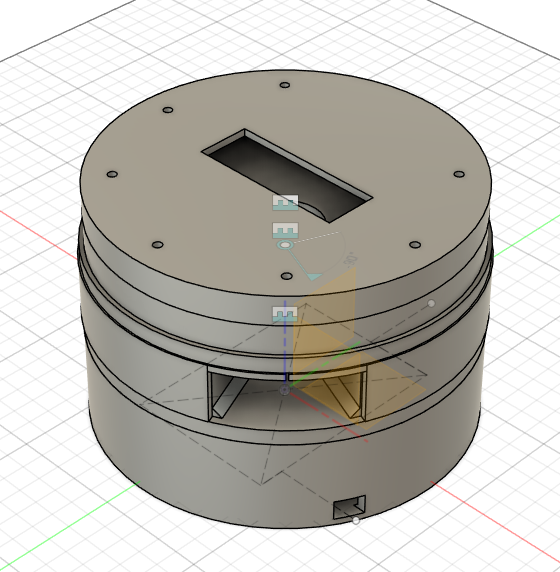

# Modelo 3D

Este directorio contiene el diseño 3D del sistema, desarrollado en Autodesk Fusion. Incluye los archivos CAD de cada componente (Para Inventor), una animación del mecanismo en funcionamiento y parámetros personalizables para facilitar futuras modificaciones.

## Tabla de contenido

1. [Archivos incluidos](#Archivos-incluidos)
2. [Animación del Funcionamiento](#Animación-del-Funcionamiento)
3. [Componentes principales](#Componentes-principales)
    1. [1. Deslizador](#1-deslizador)
    2. [2. Espacio para módulo FPGA](#2-espacio-para-módulo-fpga)
    3. [3. LCD – Almacenamiento (1)](#3-lcd--almacenamiento-1)
    4. [4. LCD – Almacenamiento (2)](#4-lcd--almacenamiento-2)
    5. [5. Pastillero](#5-pastillero)
    6. [6. Vista del Ensamble](#6-vista-del-ensamble)
4. [Parámetros de diseño](#Parámetros-de-diseño)
5. [Recomendaciones](#Recomendaciones)

---

## Archivos incluidos

- Archivos `.ipt` del ensamblaje completo.
- Animación del mecanismo (`.mp4` y `.gif`).
- Parámetros de diseño editables para control dimensional centralizado.

---

## Animación del Funcionamiento

  

La animación muestra el funcionamiento mecánico completo del sistema. La primera sección del cuerpo aloja el módulo FPGA, mientras que la tercera alberga el display LCD. En la parte central se encuentra un deslizador rotativo que se alinea con el pastillero, permitiendo la extracción controlada de los elementos contenidos en los compartimentos. Uno de los espacios permanece cerrado durante parte del ciclo, actuando como zona de seguridad para garantizar que los elementos no se liberen accidentalmente al iniciar o finalizar el movimiento.

---

## Componentes principales

### 1. **Deslizador**

  

Componente móvil encargado del desplazamiento guiado para ubicar el día del compartimento y retirar el contenido (pastillas).

---

### 2. **Espacio para módulo FPGA**

  

Alojamiento reservado para el módulo FPGA, con dimensiones adaptadas según los parámetros `largoFPGA` y `anchoFPGA`.

---

### 3. **LCD – Almacenamiento (1)**

  

Primera parte para el montaje del display LCD, muestra una vista del soporte que tiene un agujero para las conexiones previstas.

---

### 4. **LCD – Almacenamiento (2)**

  

Segunda parte "tapa" para el montaje del display LCD, se observa el espacio para los leds indicadores de espacio y agujero para la LCD.

---

### 5. **Pastillero**

  

Compartimentos que almacenan las pastillas del usuario dividiendo los dias. De igual manera existe como puente de conexion entre el alojamiento para la LCD y el alojamiento de la FPGA, permitiendo funcionalidad (agujero transversal).

---

### 6. **Vista del Ensamble**

  

Ensamble general del sistema, muestra la integración entre el módulo FPGA, el sistema de visualización, y la base contenedor.

## Parámetros de diseño

Los archivos usan parámetros en Fusion para facilitar cambios y mantener uniformidad dimensional. Algunos ejemplos:

Los siguientes parámetros están definidos en el modelo CAD (Fusion):

| **Nombre**    | **Unidad** | **Valor** | **Descripción**                                        |
|---------------|------------|-----------|--------------------------------------------------------|
| Espesor       | mm         | 7         | Espesor general de cada pared                         |
| largoFPGA     | mm         | 120       | Largo de la FPGA (Valor medido)                       |
| anchoFPGA     | mm         | 95        | Ancho de la FPGA (Valor medido)                       |
| cable1        | mm         | 5         | Agujero para el cable 1 de la FPGA                    |
| cable2        | mm         | 6         | Agujero para el cable 2 de la FPGA                    |
| Cilindro      | mm         | 158.673   | Diámetro que inscribe la FPGA dentro de sí            |
| largoSSCD     | mm         | 24.45     | Largo del módulo LCD (Valor consultado)               |
| anchoSSCD     | mm         | 71.1      | Ancho del módulo LCD (Valor consultado)               |
| DimLed        | mm         | 3         | Diámetro de led (Valor consultado)                    |
| Sep           | mm         | 5         | Separación X                                          |
| CilindroSS    | mm         | 164.614   | Diámetro que inscribe el módulo LCD dentro de sí      |
| altSSCD       | mm         | 20        | Altura del módulo LCD con pines (Valor medido)        |

---

## Recomendaciones

- Para modificar el diseño, se actualizan los parámetros desde el menú de "Parametros de usuario" en Fusion.
- Se debe mantener la estructura de nombres para evitar errores de ensamblaje.
- Hay que verificar interferencias tras cambios con la herramienta de análisis.

---
