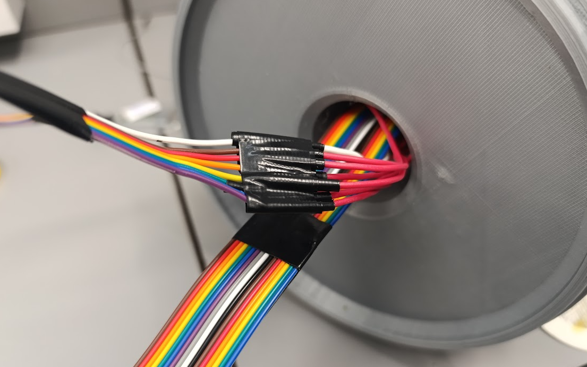
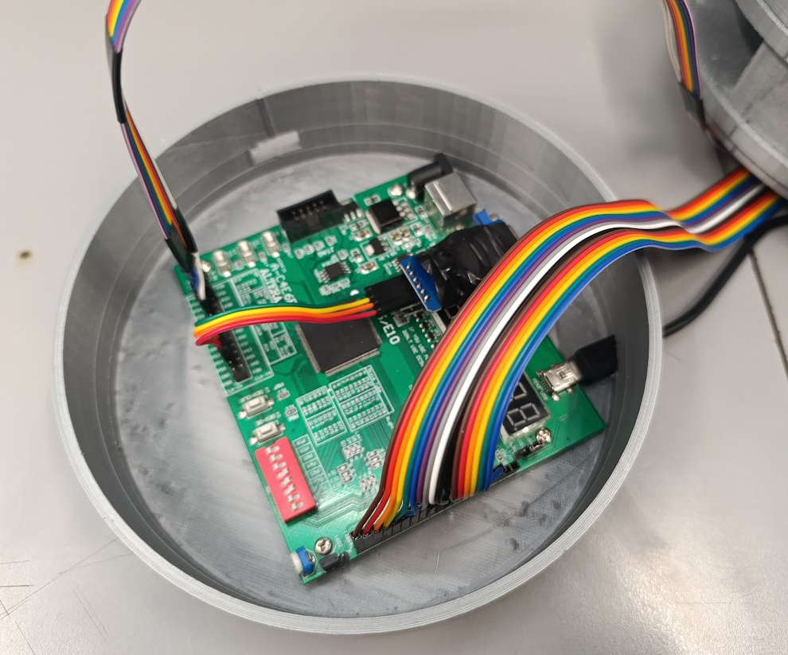

# Pastillero inteligente - JASPI

---

## Tabla de contenido

1. [Fase Arduino](#Fase-Arduino)
2. [Modelo 3D](#Modelo-3D)
3. [Analisis de RTC](#Analisis-de-RTC)

---

## Fase Arduino

[Ir a la carpeta Arduino](Arduino_Phase/README.md)

---

## Modelo 3D

[Ir a la carpeta del modelo 3D](Modelo_3D/README.md)

---

## Arquitectura Digital

[Ir a la carpeta de Arquitectura Digital](Arquitectura_Digital/README.md)

---

## Montaje Final

El montaje final constó de dos etapas:

---

### Montaje Circuital

Para los LEDs, se realizó una unión común de todas las tierras conectadas al cable blanco. Los cables rojos salientes del pastillero con forma de corazón corresponden a los pines individuales de cada LED, conectados a sus respectivos ánodos (+). Los demás cables corresponden a la pantalla LCD, la cual se conecta directamente a la FPGA junto con los demás periféricos.

  

Se aprecian las conexiones realizadas en la FPGA, incluyendo la del **RTC**, el cual está anexado a los pines multipropósito de control, al igual que los pines destinados al manejo de los LEDs. En el espacio reservado para la LCD, se encuentran sus cables organizados y dispuestos en el orden correspondiente para su correcto funcionamiento.

  

### JASPI - Pastillero Inteligente (Funcionamiento)

En el montaje final se aprecia como esta funcionando marcando la hora y iluminando un led, aunque no se aprecie el zonido, el buzzer En el montaje final se observa el correcto funcionamiento del sistema, el cual muestra la hora en la pantalla LCD e ilumina un LED en el momento programado. Aunque no se perciba en la imagen, el buzzer emite un sonido claro, con un patrón programable que se activa durante los primeros segundos de cada intervalo y cuya duración ha sido definida según los parámetros establecidos.

  

*link video con sonido 1*: https://youtu.be/T6APTC5pb8g
*link video con sonido 2*: https://youtu.be/KZL9hMM8s1c

---
